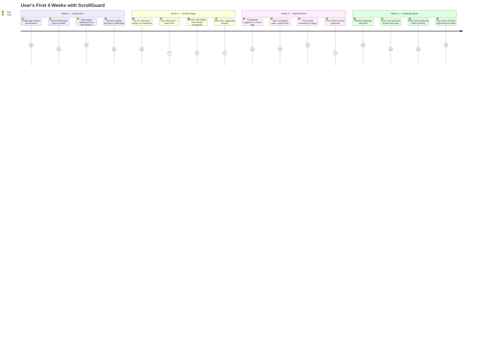
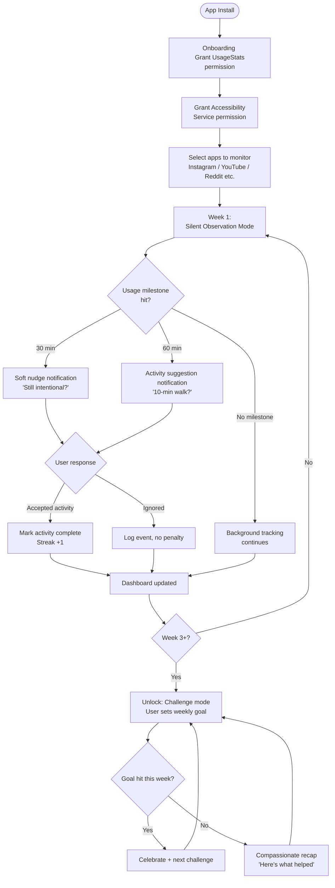
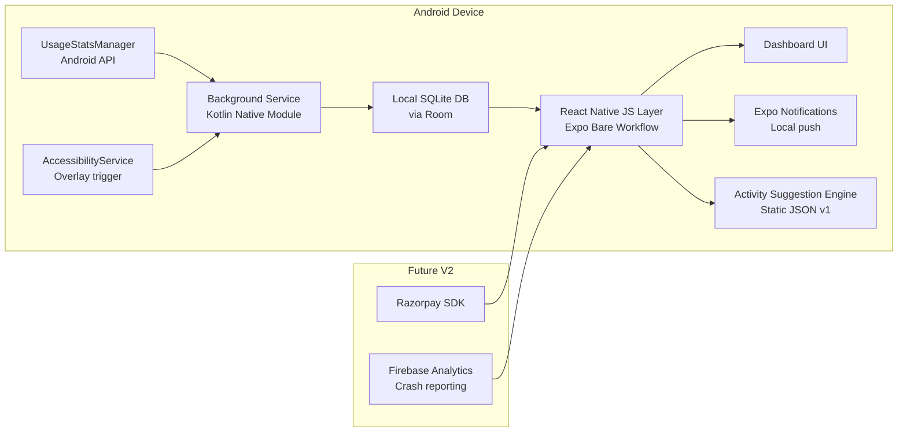

# ScrollGuard — Product Requirements Document

> **Status:** Draft v0.1 — for internal review  
> **Author:** Suraj Singh
> **Last Updated:** 9 May 2026  

---

## 1. The Problem

The average person opens their phone 100+ times a day. A significant chunk of that is not intentional — it is reflex. You pick up the phone to check one message and surface 40 minutes later having scrolled through reels, news, and content you did not choose to watch.

Existing solutions attack this with a hammer:

- **Native tools** (Android Digital Wellbeing, iOS Screen Time): blunt daily limits with a one-tap "Ignore" bypass. Functionally useless for compulsive behaviour.
- **Hard blockers** (Opal, Freedom): cut access entirely. Create resentment, not habits. High churn post-trial.
- **Friction inserters** (One Sec, ScreenZen): scientifically better, but stop at the pause. They do not redirect you anywhere. The dopamine need remains unaddressed.

**Nobody is building a companion.** Every existing tool is a cop. There is no product that earns your trust first, nudges you gently, and then redirects your freed attention toward something real.

---

## 2. Vision

> Help people reclaim their time — not by punishing screen use, but by making offline life feel more rewarding, one small step at a time.

The product is a **digital wellbeing companion**, not a blocker. The relationship arc looks like this:

```
Week 1 → Earn trust (observe, show data, no intervention)
Week 2 → Gentle nudges (soft notifications at usage milestones)
Week 3 → Habit redirection (suggest offline activities)
Week 4+ → Challenges + streaks (progressive commitment)
```

The user never feels ambushed. The hard stop is a last resort, not a first response.

---

## 3. Target Segment

### Primary: Urban Indian Adults, 18–25, Android

| Attribute | Detail |
|-----------|--------|
| Device | Android (95%+ India market share) |
| Geography | Tier 1 Indian cities to start (Bengaluru, Mumbai, Delhi, Pune, Hyderabad) |
| Pain awareness | High — 82% of Gen Z adults self-identify as social media addicted |
| Motivation | Wants to be productive, feels guilt about scrolling, has tried and failed with willpower |
| Platforms abused | Instagram, YouTube, Reddit, Snapchat |
| Willingness to pay | ₹99–149/month if the product delivers visible progress |

### Why not teenagers (13–17)?

They are the *most* affected demographic but the wrong MVP target. Reasons:
- Parental consent flows add legal and UX complexity
- Cannot self-subscribe — monetisation requires parents = long sales cycle
- DPDP Act (India) and COPPA compliance overhead
- Target for V3 once core product is validated

### Why not working professionals (26–35)?

Good secondary market but harder to reach. Usage patterns are different (LinkedIn, news, WhatsApp vs. Reels/YouTube). Target for V2 expansion.

---

## 4. User Personas

### Persona A — "The Guilty Scroller" (Primary)
**Arjun, 21, Engineering student, Pune**
- Spends 5–6 hours/day on YouTube and Instagram
- Knows it is a problem, has tried Screen Time, disabled it after 2 days
- Wants to study more, go to the gym, cook — but the phone wins every time
- Would pay ₹99/month if the app actually showed him improving

### Persona B — "The Motivated Starter" (Secondary)
**Priya, 24, Junior software engineer, Bengaluru**
- Recently started a "no phone after 10pm" rule — broke it 3 days in
- Fitness-conscious, already uses a step tracker
- Wants accountability, not lecturing
- Would recommend the app to friends if it worked — high referral potential

---

## 5. Product Principles

1. **Companion, not cop.** Never surprise the user. No hard blocks without consent and ramp-up.
2. **Progress over perfection.** A 10% reduction celebrated is better than a 50% reduction resented.
3. **Replace, don't just remove.** Every intervention should offer an alternative, not a wall.
4. **Earn the right to push harder.** Interventions get stronger only as trust is established over time.
5. **Data stays on device.** No selling usage data. Privacy is a product feature, not a footnote.

---

## 6. User Journey



---

## 7. Core User Flow



---

## 8. Feature Scope

### V1 — Validate Core Loop (Target: 8–10 weeks to build)

**Goal:** Prove that users will engage with a companion-style nudge over 30 days without churning.  
**Success metric:** 40%+ of installs still active at Day 30.

| Feature | Description | Priority |
|---|---|---|
| App usage tracking | Read daily time-in-app via `UsageStatsManager` | Must |
| App selection | User picks 2–5 apps to monitor | Must |
| Milestone notifications | Soft nudge at 30 min, 60 min per selected app | Must |
| Activity suggestion | Static list of 30 offline suggestions shown with nudge | Must |
| Dashboard | Today's usage, yesterday comparison, streak counter | Must |
| Weekly summary | Sunday evening push notification recap | Must |
| Onboarding | Permission flow with plain-language explanation | Must |
| Activity confirmation | One-tap "I did it" to count streak | Should |
| Data privacy screen | All data is on-device, no account needed | Should |

**Explicitly out of scope for V1:**
- User accounts / login
- Social features
- AI or personalised suggestions
- Custom challenge creation
- Cross-device tracking
- Payments / paywall

---

### V2 — Retention + Monetisation (Target: 3–4 months post V1 launch)

**Goal:** Convert engaged free users to paid. Introduce personalisation.  
**Success metric:** >3% free-to-paid conversion. Day 60 retention >25%.

| Feature | Description |
|---|---|
| Freemium paywall | Basic tracking free. Challenge system + history behind ₹99/month |
| Challenge system | Weekly themed challenges (e.g. "Scroll-free mornings for 5 days") |
| Categorised activities | Activities grouped by time available (5 min / 15 min / 30 min+) |
| Smarter nudge timing | Learn user's high-risk windows (e.g. 10pm–midnight) and nudge earlier |
| Monthly report | Visual progress over 30 days — shareable card |
| Referral mechanic | Share streak card to WhatsApp/Instagram stories |
| Razorpay integration | In-app subscription for Indian users |

---

### V3 — Expansion (Target: 6+ months post V1)

**Goal:** Expand to new segments and platforms.

| Feature | Description |
|---|---|
| Teen mode | Parental oversight dashboard, age-appropriate UI, DPDP-compliant |
| Partner integrations | Link with Strava, Headspace, or a recipe app for richer activity suggestions |
| Accountability circles | Opt-in groups (friends / family) with shared streaks |
| iOS port | Leverage existing React Native codebase — work within ScreenTime API limits |
| Laptop companion | Chrome extension for browser doomscrolling (YouTube, Reddit) |
| B2B / employer tier | Wellness dashboard for HR teams; HRMS integrations |

---

## 9. Technical Architecture (V1)



**Key technical decisions:**

| Decision | Choice | Rationale |
|---|---|---|
| Framework | React Native + Expo Bare | Cross-platform later. Bare workflow needed for native Android APIs |
| Screen time data | `UsageStatsManager` | Only reliable way to get per-app usage on Android without root |
| In-app overlay | `AccessibilityService` | Enables mid-session nudge overlay inside Instagram/YouTube |
| Storage | SQLite on-device (Room via native module) | No backend in V1. Privacy by design. |
| Notifications | Expo Notifications | Handles local push without a server in V1 |
| Backend | None in V1 | Eliminates ops cost, speeds launch, validates core loop offline |

---

## 10. Permissions Required

| Permission | Why |
|---|---|
| `PACKAGE_USAGE_STATS` | Read per-app time. Requires user to manually enable in Settings |
| `SYSTEM_ALERT_WINDOW` | Draw overlay nudge on top of other apps |
| `RECEIVE_BOOT_COMPLETED` | Restart background tracking service after reboot |
| `FOREGROUND_SERVICE` | Keep tracking service alive in background |

> **Note:** These are sensitive permissions. Onboarding must explain each one in plain language with a clear "why". Users who don't understand will deny and uninstall.

---

## 11. Go-to-Market Plan

### Phase 0 — Friends & Family APK (Weeks 1–8)
- Share APK directly via WhatsApp
- Target: 15–25 testers
- Collect: Do they use it after day 7? What do they ignore? What do they love?
- Tool: Google Forms for structured feedback + informal WhatsApp calls

### Phase 1 — Soft Launch via Personal Network (Month 3)
- LinkedIn post (founder's story angle — relatable, not a product pitch)
- WhatsApp broadcast to relevant groups
- Twitter/X thread on the insight (doomscrolling companion vs. blocker framing)
- Target: 200–500 installs
- Measure: D1, D7, D30 retention via Firebase Analytics (free, sufficient for this stage)

### Phase 2 — Paid Acquisition Experiment (Month 4–5, post PMF signal)
- Run small Meta/Instagram ad campaigns (₹5,000–10,000 budget to start)
- Target: Urban Indian college students, interest in productivity, self-improvement
- Attribution: **Firebase + UTM parameters** at this stage, not AppsFlyer
  - AppsFlyer is excellent but costs ~$300–500/month minimum. Overkill until you're spending ₹1L+/month on ads.
  - Branch.io is a cheaper alternative with a meaningful free tier
  - At your current stage: UTM links + Firebase Events gives you 90% of what you need for zero cost
- Measure: CPI (cost per install), D7 retention by campaign, conversion to paid

### Phase 3 — Community & Organic (Ongoing)
- Reddit communities: r/digitalminimalism, r/nosurf, r/productivity
- Indian communities: Reddit India, College-specific WhatsApp/Telegram groups
- Referral card mechanic (V2): shareable streak image drives organic loop

---

## 12. Success Metrics

| Metric | V1 Target | Why It Matters |
|---|---|---|
| D1 Retention | >60% | Did onboarding work? |
| D7 Retention | >35% | Is the core loop compelling? |
| D30 Retention | >25% | Is there real habit formation? |
| Avg nudge response rate | >20% | Are notifications landing? |
| Activity completion rate | >15% of nudges | Does redirection work? |
| Weekly summary open rate | >40% | Is progress visible enough to motivate? |

> Do not measure downloads. Downloads are vanity. D30 retention is the only number that tells you if the product works.

---

## 13. Open Questions (For Discussion)

These are unresolved — input needed from reviewers:

1. **The hard stop design:** At what point (week 4? week 6?) should the app introduce an actual time limit with the user's consent? What should that UX look like to avoid the "abrupt" feeling?

2. **Companion identity:** Should the companion have a name and a visual character, or stay minimal/text-only? A character could drive attachment but adds design scope.

3. **Zero-account V1:** Right call for speed, but means no cross-device, no backup, no referral tracking. Acceptable trade-off?

4. **Notification fatigue risk:** If the user ignores 3 nudges in a row, should the app back off? For how long?

5. **India-first activity suggestions:** "Go for a walk" lands differently at 2pm in June in Chennai vs. 8pm in Bengaluru. Does static content work, or do we need time/weather awareness in V1?

---

## 14. What We Are NOT Building

To be explicit — these are intentional exclusions, not oversights:

- ❌ An AI chatbot companion
- ❌ Cross-device (phone + laptop) tracking in V1
- ❌ Social media feed replacement
- ❌ Content recommendations
- ❌ Any server-side data collection in V1
- ❌ iOS version before Android PMF is proven
- ❌ TV / smart device integration

---

*This document is a living draft. Last updated May 2026.*